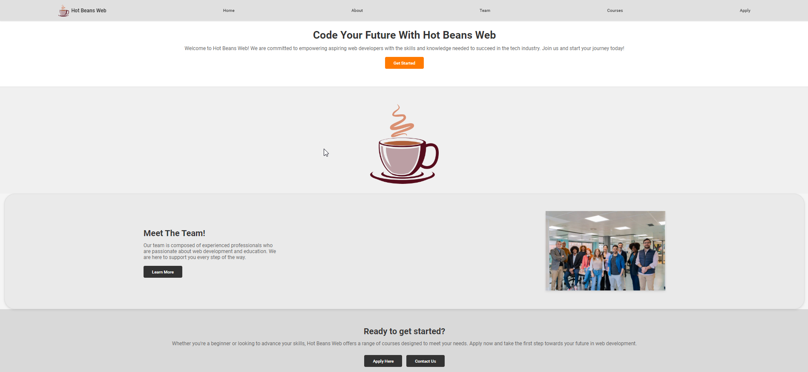
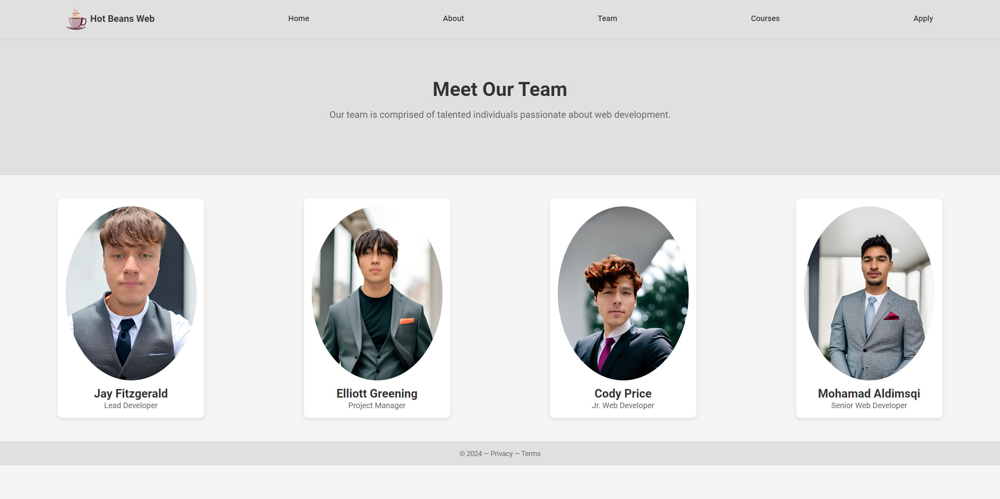
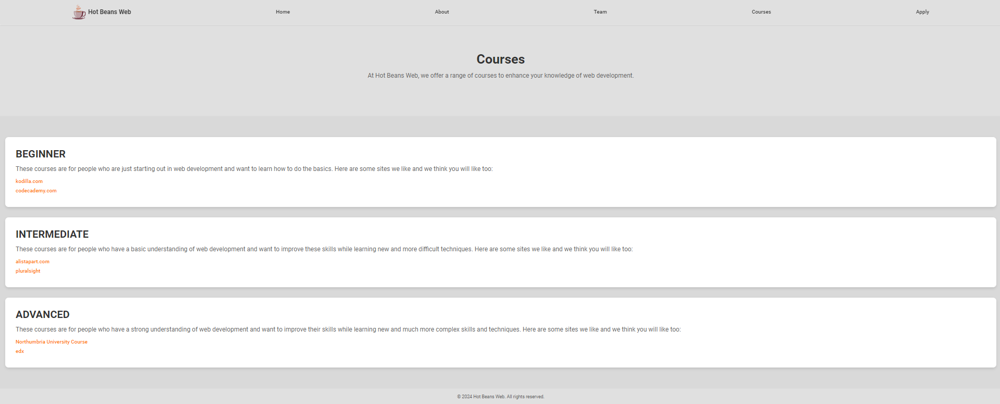
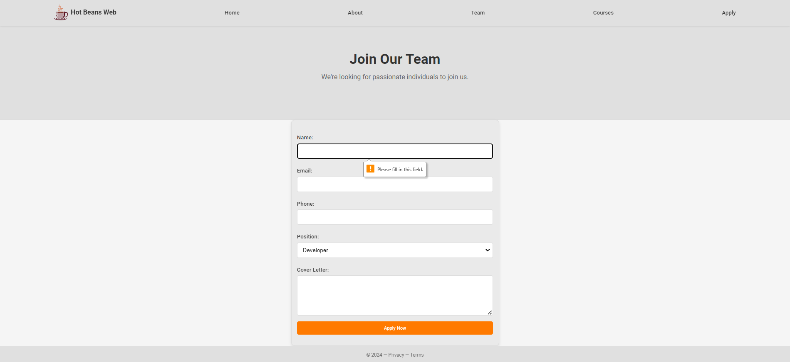
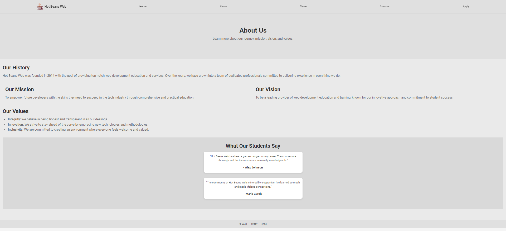

# Hot Beans Web by Jay Fitzgerald

Welcome to my repository for the new recruitment section of Hot Beans Web. This project was developed to attract prospective web developers by providing detailed information about the company, job roles, and an easy application process as asked by City College Plymouth to complete this assignment to pass a unit (Unit 15) to go towards a qualifcation in Level 3 Foundation Diploma in Computing.

## Table of Contents

- [Project Overview](#project-overview)
- [Features](#features)
- [Technologies Used](#technologies-used)
- [Installation](#installation)
- [Usage](#usage)
- [Screenshots](#screenshots)
- [Design Process](#design-process)
- [Testing and Optimization](#testing-and-optimization)
- [Contributing](#contributing)
- [License](#license)
- [Contact](#contact)

## Project Overview

As a junior web developer at Hot Beans Web, I was tasked with creating a new section on the company’s website to promote the company to prospective employees. This section is aimed at individuals who have completed web development training and are now seeking job opportunities. 

The section includes:
- A profile of the company
- Profiles of existing trainee web developers
- Job specifications and required qualifications
- An online application form
- Links to web development courses

## Features

- **Company Profile**: Information about Hot Beans Web.
- **Trainee Profiles**: Profiles of existing trainee web developers.
- **Job Specifications**: Detailed job roles and required qualifications.
- **Online Application Form**: A form for users to apply for job positions.
- **Course Links**: Links to relevant web development courses.

## Technologies Used

- **HTML**: For structuring the web pages.
- **CSS**: For styling the web pages.
- **JavaScript**: For interactivity and dynamic content.

## Installation

To run this project locally, follow these steps:

1. **Clone the repository**:
    ```bash
    git clone https://github.com/your-username/hot-beans-web-recruitment.git
    ```

2. **Navigate to the project directory**:
    ```bash
    cd hot-beans-web-recruitment
    ```

5. **Run the project**:
    - Open `index.html` in your web browser.

## Usage

Users can navigate through the website, view the team over at Hot Beans Web, check job specifications, and apply online. They can also find links to web development courses for further learning.

## Screenshots


*Home Page for Hot Beans Web*


*Meet The Team Page*


*Job Specifications Page*


*Online Application Form*


*About Hot Beans Web*

## Design Process

### Identification of User Requirements

The target audience includes individuals who have completed web development training and are looking for job opportunities. The website needed to be informative, user friendly, and engaging.

### Visual Designs for the Pages

The design emphasizes a clean and professional layout with intuitive navigation and high quality images but still remaining simple to allow me to take advantage of as many marks possible. 


### Technical Documentation

The website was built using HTML, CSS and JavaScript. Technical documentation includes details on the technologies used, the structure of the website, and implementation steps.

## Testing and Optimization

### Testing

The website was tested for:
- **Functionality**: Ensuring all features, including the application form, work as intended (On the front end).
- **Compatibility**: Testing on different devices and browsers.
- **Usability**: Conducting user testing to gather feedback.

### Optimization

Based on testing and feedback, the website was optimized for performance and usability. 

## Contributing

Please feel free to fork this repo and use it how you would like but please abide by the licesning.

## License

This project is licensed under the MIT License.

## Contact

For any inquiries, please contact:
- **Jay Fitzgerald**
- **Email**: DJayFitz11@gmail.com

---

Thank you for visiting my Hot Beans Web - Recruitment Section repository!
